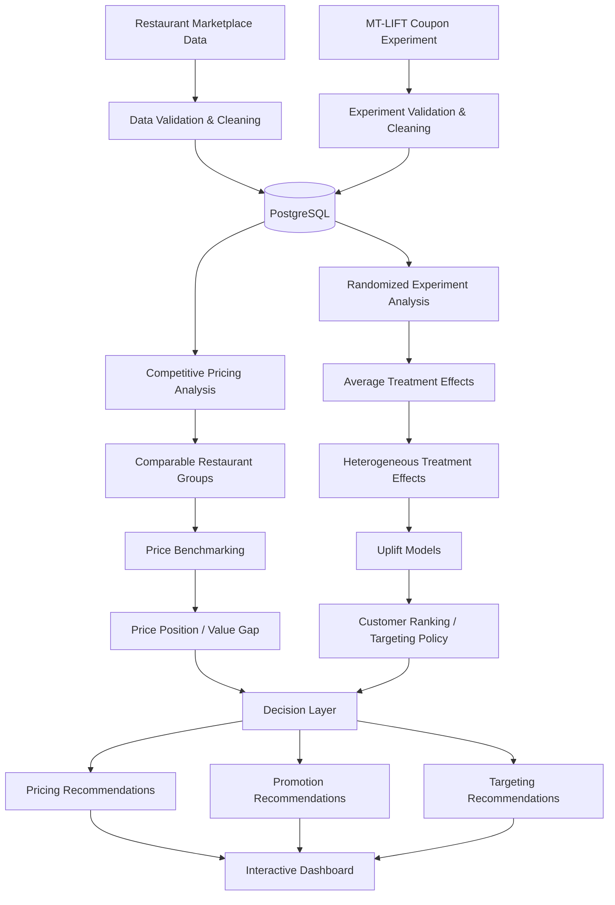

# Food Delivery Marketplace Pricing & Promotion Intelligence

> A decision-science project investigating how food-delivery marketplaces can evaluate competitive restaurant pricing, measure the causal impact of promotions, and identify which customers are most likely to change their purchasing behavior because of an incentive using experimentation, causal inference, and uplift modeling.


## Project Status

**In development**

Current scope:

* [ ] Data acquisition and validation
* [ ] PostgreSQL database setup
* [ ] Marketplace pricing analysis
* [ ] Exploratory data analysis
* [ ] Randomized promotion analysis
* [ ] Causal inference / treatment-effect estimation
* [ ] Uplift modeling
* [ ] Promotion targeting simulation
* [ ] Interactive dashboard
* [ ] Executive recommendation
* [ ] Production limitations and next steps

No performance or business-impact results are reported in this README until they are produced by the completed analysis.

---

# 1. Business Problem

Food-delivery platforms and restaurants frequently use discounts, coupons, and promotional offers to increase customer orders.

However, a promotion creating more orders does not necessarily mean the promotion **caused** those orders.

A restaurant may experience higher demand because of:

* weekends or holidays,
* local events,
* weather,
* seasonal patterns,
* differences in customer behavior,
* restaurant popularity,
* changes in delivery conditions,
* or other factors unrelated to the promotion itself.

There is also a second problem: even when a promotion works on average, giving the same discount to every customer may waste promotional budget.

Some customers would have ordered without receiving a coupon. Others may only order because of the incentive.

The business therefore faces three connected decisions:

1. **Pricing:** Is the restaurant competitively priced relative to similar restaurants?
2. **Promotion effectiveness:** Did the discount actually cause additional customer behavior?
3. **Targeting:** Which customers should receive a promotion if promotional budget is limited?

This project builds an analytics framework for answering those questions using marketplace data, experimentation, causal inference, and uplift modeling.

The goal is not simply to predict whether someone will order.

The goal is to support a decision:

> **Who should receive a promotion, when should it be offered, and when is the business spending money on a customer who would have converted anyway?**

---

# 2. Business Questions

## 2.1 Competitive Pricing

How does a restaurant's pricing compare with similar competitors in the same market?

Rather than comparing every restaurant with every other restaurant, competitors will be matched using characteristics such as:

* cuisine,
* geographic area,
* restaurant category,
* rating,
* and other relevant marketplace characteristics.

Where suitable menu data is available, restaurants will also be compared using a **standardized basket** rather than unrelated individual menu items.

Example:

**Burger restaurant basket**

* Burger
* Fries
* Drink

This allows the analysis to estimate measures such as:

* local median basket price,
* restaurant price premium or discount,
* percentile within the competitive set,
* price differences across cuisine categories,
* and whether observed premiums appear associated with ratings, location, delivery experience, or other characteristics.

---

## 2.2 Promotion Effectiveness

Do coupons actually cause customers to convert?

This part of the project uses randomized experimental data rather than relying only on correlations between promotions and orders.

The analysis will estimate:

* treatment conversion rate,
* control conversion rate,
* absolute treatment lift,
* relative treatment lift,
* confidence intervals,
* statistical significance,
* and treatment effects across multiple coupon strategies.

The objective is to distinguish:

> **"Customers who received coupons converted more often."**

from the stronger causal statement:

> **"Random assignment to a coupon treatment produced an incremental change in conversion."**

---

## 2.3 Promotion Targeting

Should promotions be distributed broadly or concentrated on customers with the largest expected incremental response?

Traditional conversion models estimate:

> Who is likely to order?

That is not necessarily the correct targeting question.

This project instead asks:

> Who is more likely to order **because they received the promotion**?

The analysis will estimate heterogeneous treatment effects and rank observations by predicted incremental response.

The resulting targeting policy will be evaluated under different budget constraints.

Example questions include:

* What happens if only 10% of eligible customers can receive a coupon?
* What about 20%?
* How many incremental conversions can each strategy capture?
* How much promotion exposure can be avoided relative to blanket targeting?
* Which model produces the strongest uplift among the customers it prioritizes?

---

# 3. Data Sources

The project uses separate datasets for separate analytical purposes rather than forcing one dataset to support claims it was not designed to answer.

## 3.1 Promotion & Causal-Inference Data — MT-LIFT

**Source:** Meituan MT-LIFT dataset
**Context:** Food-delivery coupon marketing experiments

MT-LIFT contains approximately **5.5 million observations** collected from randomized coupon-marketing experiments on Meituan's food-delivery platform.

The dataset includes:

* 99 anonymized features (`f0`–`f98`)
* treatment assignment
* five treatment values (`0`–`4`)
* click outcome
* conversion outcome

Coupon treatments were randomly assigned, making the dataset suitable for estimating causal treatment effects and evaluating uplift models.

### Primary use in this project

MT-LIFT will support:

* randomized experiment analysis,
* average treatment-effect estimation,
* coupon-treatment comparisons,
* heterogeneous treatment-effect estimation,
* uplift modeling,
* targeting-policy evaluation,
* and promotion-budget simulations.

### Important limitation

The customer/context features are anonymized.

Therefore, this project will **not** make unsupported interpretations such as:

> "`f17` represents customer income."

The anonymized variables will be treated as predictive covariates unless their meaning is explicitly documented.

---

## 3.2 Restaurant Marketplace Data

A separate restaurant-level dataset will support the competitive-pricing portion of the project.

Required fields include as many of the following as can be obtained reliably:

| Field                   | Purpose                               |
| ----------------------- | ------------------------------------- |
| Restaurant              | Entity identification                 |
| Cuisine                 | Competitive grouping                  |
| City / neighborhood     | Geographic grouping                   |
| Latitude / longitude    | Proximity analysis                    |
| Rating                  | Restaurant-quality control            |
| Rating count            | Popularity / confidence measure       |
| Menu or basket price    | Pricing comparison                    |
| Delivery fee            | Total customer cost                   |
| Promotion               | Marketplace offer analysis            |
| Estimated delivery time | Service-level comparison              |
| Observation timestamp   | Longitudinal analysis where available |

The exact public marketplace source will be documented after final selection.

Priority will be given to data that is:

1. legally/publicly accessible,
2. reproducible,
3. sufficiently documented,
4. relevant to restaurant delivery,
5. and capable of supporting the project's pricing questions.

---

## 3.3 Optional U.S. Marketplace Validation Sample

If practical, the project will include a smaller manually collected or otherwise permitted sample from one or more U.S. food-delivery markets.

The purpose is **not** to reproduce the scale of a commercial marketplace.

Instead, the sample would demonstrate how the pricing framework transfers to a recognizable current-market setting.

Potential observations include:

* comparable restaurants,
* standardized menu baskets,
* listed promotions,
* delivery fees,
* ratings,
* delivery estimates,
* location,
* and observation time.

This dataset will remain separate from MT-LIFT because the two sources represent different populations and cannot be joined at the customer level.

---

# 4. Data Architecture

The project intentionally separates **marketplace pricing intelligence** from **promotion experimentation** before combining their outputs at the decision layer.



### Analytical separation

The architecture prevents several invalid shortcuts.

For example:

**Marketplace promotion observed + higher demand**

does not automatically imply:

**Promotion caused higher demand.**

The randomized MT-LIFT experiment is used for causal claims.

Likewise, MT-LIFT's anonymized customer features cannot answer:

**Which burger restaurant in a particular neighborhood is overpriced?**

The marketplace dataset is used for that question.

Each dataset therefore has a clearly defined analytical role.

---

# 5. Data Pipeline & Repository Design

The project will separate raw data, processing, SQL analysis, modeling, and presentation rather than placing the entire workflow inside one notebook.

```text
marketplace-promo-intelligence/
│
├── README.md
│
├── data/
│   ├── README.md
│   ├── raw/
│   ├── interim/
│   └── processed/
│
├── notebooks/
│   ├── 01_data_validation.ipynb
│   ├── 02_marketplace_eda.ipynb
│   ├── 03_pricing_analysis.ipynb
│   ├── 04_experiment_analysis.ipynb
│   ├── 05_treatment_effects.ipynb
│   └── 06_uplift_modeling.ipynb
│
├── src/
│   ├── data/
│   ├── features/
│   ├── causal/
│   ├── models/
│   └── visualization/
│
├── sql/
│   ├── 01_create_tables.sql
│   ├── 02_data_quality_checks.sql
│   ├── 03_market_benchmarks.sql
│   ├── 04_pricing_analysis.sql
│   └── 05_experiment_metrics.sql
│
├── dashboard/
│
├── reports/
│   └── figures/
│
├── requirements.txt
└── .gitignore
```

Large source datasets will not be committed directly to Git.

`data/README.md` will document:

* dataset name,
* original source,
* access instructions,
* expected file names,
* data dictionary,
* licensing/use restrictions,
* and preprocessing steps required to reproduce the analysis.

---

# 6. Methodology

The project follows a progression from descriptive analytics to statistical inference, causal inference, and decision optimization.

## Phase A — Data Validation

Before modeling, both data sources will be evaluated for:

* missing values,
* duplicate records,
* treatment distribution,
* outcome distribution,
* invalid values,
* feature distributions,
* class imbalance,
* inconsistent types,
* and potential data leakage.

For the randomized experiment, treatment groups will also be checked for baseline balance where appropriate.

---

## Phase B — Competitive Pricing Analysis

Restaurants will be grouped into meaningful competitive sets using characteristics such as:

* cuisine,
* geography,
* restaurant category,
* and relevant quality indicators.

Possible analyses include:

### Descriptive benchmarking

Calculate:

* mean price,
* median price,
* price percentiles,
* competitor count,
* restaurant price premium,
* and standardized basket differences.

Example:

```text
Restaurant basket price:       $29.50
Comparable-market median:      $24.60
Price premium:                 +19.9%
```

### Statistical testing

Where appropriate, hypothesis tests and confidence intervals will be used to determine whether observed price differences are large enough to distinguish from normal variation.

### Regression analysis

An interpretable regression model may be used to estimate how restaurant characteristics relate to observed pricing.

Potential explanatory variables include:

* cuisine,
* location,
* rating,
* popularity,
* delivery time,
* and other available marketplace attributes.

The purpose of this model is explanation and benchmarking—not simply maximizing predictive accuracy.

---

## Phase C — Randomized Promotion Analysis

The first causal model will deliberately be simple.

For each relevant treatment:

$$
ATE = E[Y|T=t] - E[Y|T=control]
$$

where:

* \(Y\) represents an outcome such as conversion,
* \(T\) represents assigned coupon treatment.

The analysis will report:

* treatment-group size,
* treatment conversion rate,
* control conversion rate,
* absolute lift,
* relative lift,
* confidence interval,
* and statistical significance.

This creates an interpretable causal baseline before applying machine-learning methods.

---

## Phase D — Heterogeneous Treatment Effects

Average treatment effects answer:

> Does the promotion work on average?

The next question is:

> Does it work equally well for everyone?

The project will investigate variation in treatment response using causal machine-learning approaches.

Candidate approaches include:

### Baseline

* constant average treatment effect

### Meta-learners

* S-Learner
* T-Learner
* X-Learner

### Advanced model

* Causal Forest

Not every model listed above must appear in the final project.

Models will be retained only when they provide a useful methodological comparison or improve the targeting decision.

---

## Phase E — Uplift Evaluation

Traditional prediction accuracy is not enough for this problem.

The purpose of the model is to correctly prioritize customers according to their **incremental response to treatment**.

Evaluation will therefore include uplift-oriented metrics such as:

* uplift curves,
* Qini curves,
* Qini coefficient,
* AUUC,
* treatment-effect calibration where feasible,
* and policy performance at different targeting depths.

The strongest model will not necessarily be the most complicated model.

Model selection will consider:

1. targeting performance,
2. stability,
3. interpretability,
4. computational cost,
5. and usefulness for the business decision.

---

## Phase F — Promotion Targeting Simulation

The final causal model will be converted into a decision policy.

Customers will be ranked according to predicted incremental treatment effect.

The project will then simulate policies such as:

* target top 10%,
* target top 20%,
* target top 30%,
* target top 50%,
* and blanket promotion.

For each policy, the analysis will estimate measurable outcomes supported by the available data.

Example comparison:

| Strategy          | Customers Targeted | Incremental Conversions | Relative Efficiency |
| ----------------- | -----------------: | ----------------------: | ------------------: |
| Blanket promotion |                TBD |                     TBD |                 TBD |
| Top 50% uplift    |                TBD |                     TBD |                 TBD |
| Top 30% uplift    |                TBD |                     TBD |                 TBD |
| Top 20% uplift    |                TBD |                     TBD |                 TBD |
| Top 10% uplift    |                TBD |                     TBD |                 TBD |

**No values will be inserted until they are calculated from the completed analysis.**

---

# 7. Experiment Design Extension

Because this project uses an existing randomized experiment rather than controlling a live marketplace, a separate section will demonstrate how the analysis would translate into a production A/B test.

The proposed experiment will specify:

**Control:** Existing promotion strategy

**Treatment:** Uplift-targeted promotion strategy

**Primary metric:** Incremental conversion / order rate

**Potential business metric:** Incremental contribution margin, if revenue and cost data were available

**Guardrail metrics:**

* average order value,
* cancellation rate,
* customer complaints,
* promotion cost,
* restaurant profitability,
* and customer experience measures where available

The design will include:

* null and alternative hypotheses,
* significance level,
* statistical power,
* minimum detectable effect,
* sample-size calculation,
* randomization unit,
* experiment duration assumptions,
* and treatment-allocation strategy.

This section is intended to connect offline causal modeling with how the recommendation would actually be validated before a production rollout.

---

# 8. Technology Stack

### Programming & Analysis

* Python
* pandas
* NumPy
* SciPy
* statsmodels

### Data

* SQL
* PostgreSQL

### Machine Learning

* scikit-learn
* gradient-boosting library if required

### Causal Inference

* EconML and/or CausalML
* custom statistical analysis where appropriate

### Visualization

* Plotly
* Matplotlib

### Application

* Streamlit or Plotly Dash

### Development

* Git
* GitHub
* Jupyter
* VS Code

The final technology list will include only tools actually used in the completed project.

---

# 9. Results

> **To be completed after analysis.**

This section will contain only measured results produced by the project.

Planned reporting includes:

### Pricing

* competitive price distributions,
* restaurant price premiums/discounts,
* significant pricing gaps,
* and relevant drivers of observed pricing differences.

### Experimentation

* control conversion rate,
* treatment conversion rates,
* estimated average treatment effects,
* confidence intervals,
* and statistical significance.

### Targeting

* model AUUC/Qini performance,
* uplift curves,
* targeting-policy comparisons,
* and efficiency under different promotion budgets.

---

# 10. Dashboard

> **To be completed after the analytical pipeline is validated.**

Planned dashboard views:

### Marketplace View

Explore restaurants by:

* cuisine,
* geography,
* price position,
* rating,
* and promotion status.

### Experiment View

Compare:

* control,
* coupon treatments,
* conversion,
* treatment lift,
* and uncertainty.

### Targeting View

Visualize:

* uplift distribution,
* customer-ranking curves,
* targeting depth,
* and policy performance.

**Dashboard screenshot will be added here after deployment.**

---

# 11. Executive Recommendation

> **To be written after results are finalized.**

The final recommendation will answer:

1. Is the analyzed restaurant/market priced competitively?
2. Do promotions generate measurable incremental conversion?
3. Are some treatments more effective than others?
4. Is blanket promotion economically inefficient?
5. Which customers should be prioritized under a constrained promotion budget?
6. What should the business test next before deploying the strategy?

No recommendation will be made before the evidence supports it.

---

# 12. Limitations & Production Considerations

> **To be expanded after analysis.**

Known limitations already include:

* MT-LIFT comes from Meituan rather than a U.S. delivery marketplace.
* MT-LIFT features are anonymized, restricting customer-level interpretation.
* The dataset contains click and conversion outcomes but does not provide every financial metric required to calculate true promotion profitability.
* Marketplace-pricing data and MT-LIFT represent separate populations and cannot be directly joined at the customer level.
* Public listing prices may differ from completed transaction prices.
* Offline uplift performance does not guarantee equivalent production performance.
* A targeting strategy should be validated through a prospective controlled experiment before deployment.
* Customer experience, restaurant economics, promotion cost, and long-term behavior should be considered alongside short-term conversion.

Additional limitations will be documented as they emerge during analysis.

---

# 13. What I Would Test in Production

If this system were deployed on a real food-delivery platform, the next step would be a randomized experiment comparing the existing promotion strategy against the proposed targeting policy.

Key production questions would include:

* Does uplift-based targeting increase incremental orders?
* Does it reduce unnecessary coupon spend?
* Does it improve contribution margin?
* Does it affect customer retention?
* Do customers become dependent on promotions over time?
* Does targeting create different effects for new versus existing customers?
* How stable are treatment effects across cities, restaurants, cuisines, and seasons?
* Does the policy create unintended negative effects for restaurants or customers?

The objective would be to determine not only whether the model performs well offline, but whether it creates measurable and sustainable business value when used to make real decisions.
