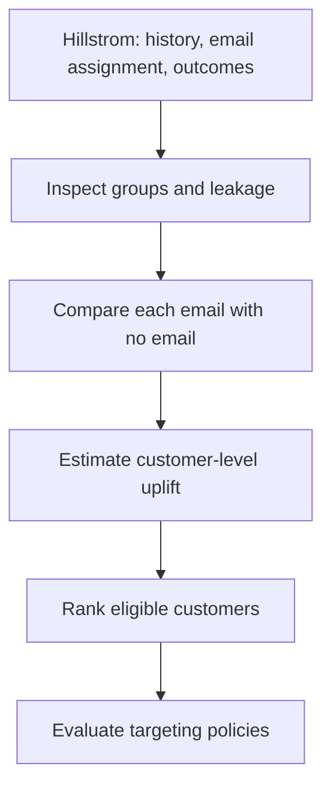

# Retail Promotion Targeting & Uplift Modeling

**Status: In development.** A retail email experiment asks a practical question: *Who should receive an email because it changes what they do, rather than because they were already likely to buy?*

## Data

The planned dataset is Kevin Hillstrom's [MineThatData E-Mail Analytics and Data Mining Challenge](https://blog.minethatdata.com/2008/03/minethatdata-e-mail-analytics-and-data.html), available through [scikit-uplift's Hillstrom loader](https://www.uplift-modeling.com/en/latest/api/datasets/fetch_hillstrom.html). It contains **64,000 customers**, randomly assigned to a **men's merchandise email**, **women's merchandise email**, or **no email**. The two weeks after assignment provide three outcomes: `visit`, `conversion`, and `spend`. The data is about 4.9 MB as a CSV, making it manageable for local analysis.

Historical fields include `recency`, `history`, `history_segment`, past men's/women's purchases, `zip_code`, `newbie`, and `channel`. This is a customer-level experiment: it does **not** contain a full transaction ledger or product-level baskets. The intervention is an email campaign, not necessarily a price discount.

## Planned workflow

1. Compare visit, conversion, and spend for each email arm against the no-email control, with uncertainty intervals.
2. Build a simple T-Learner, then compare it with another uplift method. Use only information available **before** the email as model features.
3. On held-out data, inspect uplift/Qini curves and compare sending to everyone with targeting the top 10%, 20%, or 30%. A fixed-capacity shortlist (for example, 10,000 customers) is a proposed decision scenario, not an observed business result.

**Current state:** The repository contains the plan and data source link. No modeling results or recommendation have been published here. Targeting policy estimates will need held-out evaluation; any real rollout would need a fresh controlled test.
