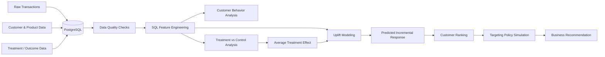

# Food Retail Promotion & Customer Targeting Intelligence

> A decision-science project evaluating whether retail promotions generate incremental purchases and identifying which customers are most likely to change their purchasing behavior because of an intervention.

Promotions are everywhere. Retailers send discounts, offers, reminders, and marketing messages constantly, but as a customer it is difficult to know how much thought actually goes into deciding **who receives an offer and whether the offer changed anything at all**.

That observation led to the main question behind this project:

> **How can a retailer distinguish customers who purchased because of a promotion from customers who would have purchased anyway?**

The project uses customer transaction and treatment data from X5 Retail Group to study customer behavior, measure promotion effectiveness, and build a more targeted promotion strategy.

The goal is not simply to predict who is likely to buy. It is to understand **who is likely to change behavior because of the intervention**.

---

## Business Questions

The project is organized around three connected questions.

### 1. How do customers behave before the promotion?

Historical transaction data is used to understand differences in customer behavior before treatment.

Customer-level features may include:

* purchase frequency,
* recency,
* historical spend,
* average basket value,
* number of transactions,
* product/category diversity,
* and shopping consistency.

This creates the behavioral foundation for the rest of the project.

### 2. Did the promotion actually work?

Customers in the treatment and control groups are compared to determine whether the intervention produced a measurable difference in purchase behavior.

The analysis will examine:

* treatment purchase rate,
* control purchase rate,
* absolute lift,
* relative lift,
* confidence intervals,
* and statistical significance.

The goal is to move beyond:

> “Customers who received the promotion purchased more.”

and toward:

> “The intervention produced measurable incremental purchasing behavior.”

### 3. Who should receive the promotion?

Even if a campaign works overall, sending promotions to every customer may be inefficient.

Some customers are likely to purchase regardless of treatment.

Others may only purchase because they received the intervention.

Uplift modeling will be used to estimate differences in individual treatment response and rank customers based on predicted incremental impact.

---

## Data

The project uses the **X5 RetailHero uplift modeling dataset**, which includes:

* customer information,
* historical purchase transactions,
* product information,
* treatment assignment,
* and a post-treatment purchase outcome.

The transaction history contains tens of millions of records, making it useful for both SQL practice and customer-level feature engineering.

The raw transaction data will not be treated as a ready-made machine-learning table. Customer behavior will first be aggregated into meaningful features using SQL and Python.

---

## Proposed System Flow

The workflow deliberately begins with customer behavior and experiment analysis before applying machine learning.

This helps answer the basic causal question first:

> **Did the intervention work at all?**

Only after that does the project move toward the more difficult targeting question.

---

## Analytical Approach

### Customer Behavior & Feature Engineering

SQL will be used to transform raw transactions into customer-level behavioral features.

Example features include:

* days since last purchase,
* transactions in recent periods,
* historical spend,
* average basket size,
* purchase frequency,
* unique products purchased,
* and other relevant customer behaviors.

These features will then be validated and explored before modeling.

### Experiment Analysis

Treatment and control groups will be compared using standard experimentation techniques.

The analysis will include:

* baseline balance checks where appropriate,
* treatment/control conversion comparison,
* confidence intervals,
* hypothesis testing,
* and average treatment-effect estimation.

A separate experiment-design section will also describe how a similar campaign could be tested prospectively using:

* primary metrics,
* guardrail metrics,
* minimum detectable effect,
* statistical power,
* sample-size calculations,
* and treatment allocation.

### Uplift Modeling

The first model will remain intentionally simple.

A baseline treatment-effect approach will be compared with a small number of uplift methods such as:

* T-Learner,
* X-Learner or another uplift model.

More advanced approaches will only be added if they improve the analysis rather than simply increasing complexity.

Models will be evaluated using uplift-focused measures such as:

* uplift curves,
* Qini curves,
* AUUC,
* and targeting performance at different customer percentiles.

---

## Targeting Policy

The final model will be translated into a business decision.

Customers will be ranked according to predicted incremental response.

Several targeting strategies will then be compared:

| Strategy         | Customers Contacted | Incremental Purchases |
| ---------------- | ------------------: | --------------------: |
| Contact everyone |                 TBD |                   TBD |
| Top 50%          |                 TBD |                   TBD |
| Top 30%          |                 TBD |                   TBD |
| Top 20%          |                 TBD |                   TBD |
| Top 10%          |                 TBD |                   TBD |

The final question is:

> **How much promotional reach can be reduced while preserving the customers most likely to respond incrementally?**

---

## Tools & Technologies

**Programming & Analysis**

* Python
* pandas
* NumPy
* SciPy
* statsmodels

**Data**

* SQL
* PostgreSQL

**Machine Learning & Causal Analysis**

* scikit-learn
* uplift modeling libraries
* treatment-effect modeling

**Visualization**

* Plotly
* Matplotlib

**Development**

* Jupyter
* Git
* GitHub

Only tools actually used in the final project will remain listed.

---

## Planned Deliverables

The completed project will include:

* PostgreSQL data model,
* SQL customer-feature queries,
* customer behavior analysis,
* treatment vs. control experiment analysis,
* treatment-effect estimates,
* uplift model comparison,
* targeting-policy simulation,
* business-focused visualizations,
* and a final executive recommendation.

---

## Results

> **To be completed after analysis.**

No hypothetical performance numbers will be reported as project results.

This section will eventually contain:

* measured treatment effect,
* confidence intervals,
* uplift-model performance,
* targeting-policy results,
* and customer segments with the strongest observed incremental response.

---

## Executive Recommendation

> **To be completed after results are finalized.**

The final recommendation will answer:

* Did the promotion create incremental purchases?
* Which customers were most responsive?
* Should promotions be sent broadly or targeted?
* What targeting depth provides the strongest trade-off between reach and incremental response?

---

## Limitations & Production Considerations

The final project will consider:

* whether treatment assignment supports causal interpretation,
* changes in customer behavior over time,
* campaign-specific effects,
* promotion fatigue,
* model drift,
* differences between offline uplift performance and live campaign performance,
* and the need for prospective A/B testing before deploying a targeting policy at scale.
