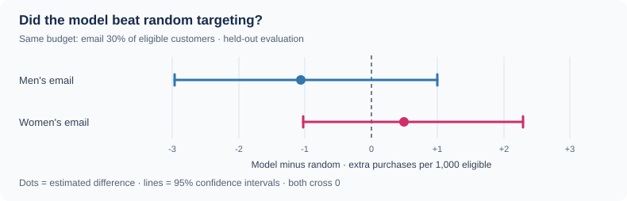

# Retail Marketing Intelligence

**Can a marketing email convince someone to buy—or would they have bought anyway?**

**[Explore the live dashboard ↗](https://retail-promotion-targeting-uplift-modeling-jdjd8epuvzztn6kxjpe.streamlit.app/)**

I explored this question using [Kevin Hillstrom's email experiment](https://blog.minethatdata.com/2008/03/minethatdata-e-mail-analytics-and-data.html). In 2008, **64,000 customers** were randomly assigned to receive a men's merchandise email, a women's merchandise email, or no email. Their purchases, website visits, and spending were recorded over the next two weeks.


## What I did

I used **Python and SQL** to prepare the data and compare each email campaign with the no-email group. Then I trained a simple **uplift model** to explore a trickier question: *can we identify people who are more likely to buy **because of** an email, rather than people who were already likely to buy?*

I put the analysis into an interactive **Streamlit** dashboard. You can explore campaign results, compare customer groups, and test how model-based targeting compares with selecting customers at random.

## What I found

Both emails increased the average purchase rate compared with sending no email:

- **Men's email:** +0.68 percentage points (95% confidence interval: +0.50 to +0.86).
- **Women's email:** +0.31 percentage points (95% confidence interval: +0.15 to +0.47).

But **the uplift model didn't show a clear advantage over random targeting** on customers held out from training. Here's the comparison when emailing 30% of eligible customers:



*The horizontal lines show uncertainty. Both cross zero, so these results don't establish that the model improves targeting.*

**What I learned:** proving an email works *on average* and predicting *exactly who should receive it* are different challenges. These results describe one historical experiment—not today's customers—and the dataset doesn't provide email costs or profit.

## Try it yourself

The **[live dashboard](https://retail-promotion-targeting-uplift-modeling-jdjd8epuvzztn6kxjpe.streamlit.app/)** has interactive charts and explanations. To run the analysis from this repository:

```bash
python -m pip install -r requirements.txt
python -m src.pipeline
python -m src.audit --require-real
python -m streamlit run app.py
```

Want to understand or check the work? I wrote a short [walkthrough and independent audit guide](docs/understand-and-check.md). The raw customer data isn't stored in this repository.

**Tools:** Python, pandas, SQL (SQLite), scikit-learn, SciPy, Streamlit, and Plotly.
