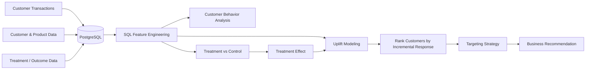

# Food Retail Promotion & Customer Targeting Intelligence

> A decision-science project evaluating whether retail promotions generate incremental purchases and identifying which customers are most likely to change their purchasing behavior because of an intervention.

Promotions are everywhere, but as a customer it is not obvious how companies decide **who should receive them** or whether those promotions actually change behavior.

This project uses customer transaction and campaign data from X5 Retail Group to answer three questions:

* How do customers behave before a promotion?
* Did the promotion actually increase purchases?
* Which customers should be targeted instead of sending promotions to everyone?

The goal is not simply to predict who will purchase. It is to estimate **who purchases because of the intervention**.

## Proposed System Flow

## Approach

### Customer Behavior

SQL and Python will be used to create features such as recency, purchase frequency, historical spend, basket behavior, and product diversity.

### Experimentation

Treatment and control groups will be compared using purchase rates, lift, confidence intervals, hypothesis testing, and treatment-effect estimates.

### Uplift Modeling

Models such as a T-Learner and one stronger uplift method will estimate which customers are most likely to respond because of the promotion.

The final analysis will compare strategies such as targeting everyone versus only the top 10%, 20%, or 30% of customers by predicted uplift.

## Tools

**Python · SQL · PostgreSQL · pandas · NumPy · SciPy · statsmodels · scikit-learn · Plotly**

## Results & Recommendation

> **To be completed after analysis.**

The final recommendation will answer whether the promotion worked, which customers responded incrementally, and how targeted campaigns compare with broad promotion strategies.

## Limitations

The final project will discuss treatment assignment, changing customer behavior, promotion fatigue, model drift, and the need to validate offline targeting strategies through future controlled experiments.
