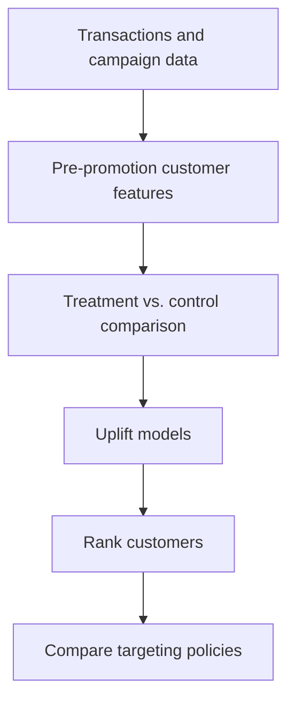

# Retail Promotion Targeting & Uplift Modeling

**Status: In development.** This project asks which customers should receive a promotion *because it changes their purchasing behavior*, rather than because they were already likely to buy.

## Planned analysis

| Step | Question |
|---|---|
| Customer history | What did each customer do before the promotion? |
| Experiment | Did treated customers buy more than comparable controls? |
| Uplift modeling | Who appears most likely to respond *because of* the offer? |
| Decision | How would targeting the top 10%, 20%, or 30% compare with sending it to everyone? |

The planned workflow uses pre-promotion recency, frequency, spend, and product diversity; a treatment/control comparison; then a T-Learner and another uplift approach. SQL/PostgreSQL and Python are planned for feature preparation and analysis.

**Current state:** This repository contains the project plan. Data processing, models, results, and a business recommendation have not been published here yet. Treatment assignment and possible selection bias will need careful review before any incremental-effect claims.
