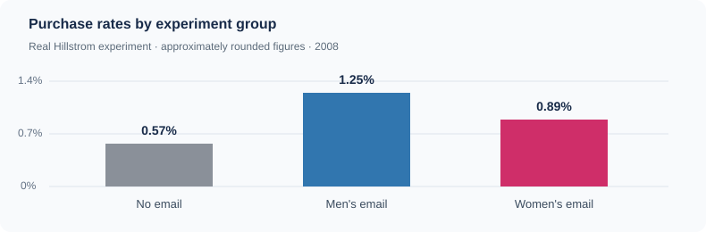

# Retail Marketing Intelligence

**Do promotional emails actually change what customers buy—and can we identify who benefits from receiving one?**

I explored this question using [Kevin Hillstrom's randomized email experiment](https://blog.minethatdata.com/2008/03/minethatdata-e-mail-analytics-and-data.html). In 2008, 64,000 customers were assigned either a men's merchandise email, a women's merchandise email, or no email. Their visits, purchases and spending were recorded over the following two weeks.



## What I built

I used **Python and SQL** to clean and explore the experiment, compared each email group with people who received no email, and trained a simple **uplift model** to estimate who might respond to marketing. The results are presented in an interactive **Streamlit and Plotly dashboard** with three views:

- **Campaigns:** Did sending either email lead to more purchases?
- **Customers:** Do the effects look different for people with different shopping histories? These comparisons are exploratory.
- **Targeting:** Does the model identify people to email more effectively than selecting them at random, *at the same marketing budget*?

## What I found

Both campaigns increased the **average purchase rate** in this historical experiment:

| Email compared with no email | Estimated increase in purchase rate | 95% confidence interval |
| --- | ---: | ---: |
| Men's merchandise | **+0.68 percentage points** | +0.50 to +0.86 pp |
| Women's merchandise | **+0.31 percentage points** | +0.15 to +0.47 pp |

At an illustrative budget of emailing 30% of customers, **neither uplift model showed a statistically clear advantage over random targeting** on held-out data. The men's model-minus-random estimate was **-1.06** extra purchases per 1,000 eligible customers (95% CI -2.96 to +1.00); the women's estimate was **+0.49** (95% CI -1.03 to +2.29). Both intervals include zero.

The takeaway: **emails can increase purchases on average, but predicting *which* people to email is a harder question.** An inconclusive model result is worth reporting; I didn't try to turn it into a success story. This was one experiment from 2008, not evidence of how today's customers would behave. Neither email costs nor profit were available.

## Explore the interactive dashboard

The Streamlit app includes an overview and three interactive charts. Run it yourself below, or [deploy your own public version](#share-the-dashboard-publicly). A permanent public link can be added here after deployment; temporary GitHub Codespaces links are not suitable for a portfolio.

## Run it yourself

With Python 3.11+ in the root of this repository:

```bash
python -m pip install -r requirements.txt
python -m src.pipeline
python -m src.audit --require-real
python -m streamlit run app.py
```

The pipeline downloads the original dataset, builds a local SQLite database, calculates campaign effects and trains the uplift models. If the source download is blocked, save the [original CSV](https://www.minethatdata.com/Kevin_Hillstrom_MineThatData_E-MailAnalytics_DataMiningChallenge_2008.03.20.csv) locally and run `python -m src.pipeline --csv /path/to/hillstrom.csv` instead. The raw CSV and local full database are deliberately not committed.

**Want to check the work rather than trust the charts?** See [How the analysis works and how to audit it](docs/understand-and-check.md). `python -m src.audit --require-real` independently recalculates group results from SQLite, checks significance and rechecks saved held-out scores when present. Run `pytest -q` for automated code checks. Neither step substitutes for evaluating the statistical assumptions or replicating a new marketing experiment.

## Share the dashboard

See [Streamlit](https://retail-promotion-targeting-uplift-modeling-jdjd8epuvzztn6kxjpe.streamlit.app/)

## A note on interpretation

- Random assignment supports estimating each email's **average effect** compared with no email. It doesn't tell us the individual customer whose purchase was caused by an email.
- Customer subgroup charts suggest questions worth following up. They don't prove that one subgroup genuinely responds better; no formal subgroup interaction analysis was done.
- The targeting comparison uses customers held out from model training. Confidence bands are approximate, and marketing send costs were not supplied. A new randomized test would be needed before real-world deployment.

**Tools:** Python, pandas, SQLite, scipy, scikit-learn (T-Learner), Streamlit and Plotly. See [`src/`](src) for analysis code and [`tests/`](tests) for automated checks.
